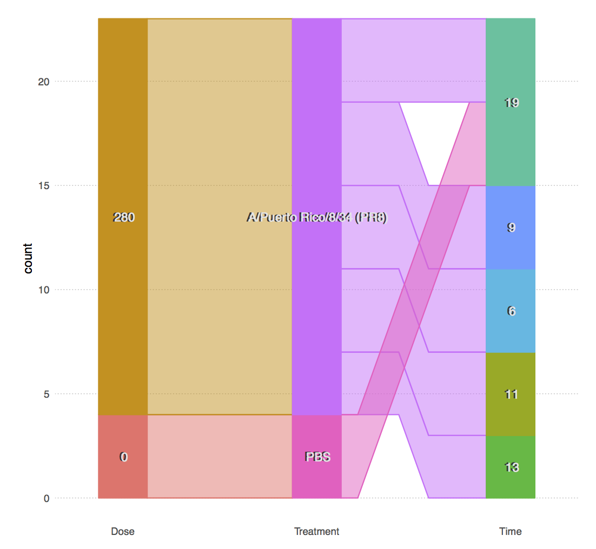

# MTBLS Factors Viz 
Version: 0.2.0 

## Short Description

A container image for generating images to represent factors inside an ISA-Tab document or MTBLS study. 

## Description

An R-based visualization for factors and their values as encoded in an ISA-Tab factor JSON output, or in MTBLS Parallel Coordinates JSON output. This implementation generates a static Parallel Sets Hammock plot using the ggparallel package.

## Key features

## Functionality

- Other Tools

## Approaches
  
## Instrument Data Types

## Screenshots

Sample plot produced by mtbls-factors-viz, showing factors values for a toy problem.


## Tool Authors

- [Pablo Moreno](https://github.com/pcm32)
- [David Johnson]()

## Container Contributors

- [Pablo Moreno](https://github.com/pcm32) (EMBL-EBI)

## Website

- 

## Git Repository

- https://github.com/phnmnl/container-mtbls-factors-viz

## Installation 

mtbls-factors-viz is present on all PhenoMeNal Galaxy instances on deployed Cloud Research Environments, under the ISA tools category in the tool bar to the left of the screen. No installation is needed hence on PhenoMeNal Cloud Research Environments.

For advanced Docker usage:

- Go to the directory where the dockerfile is.
- Create container from dockerfile:

```
docker build -t mtbls-factors-viz .
```

Alternatively, pull from repo:

```
docker pull container-registry.phenomenal-h2020.eu/phnmnl/mtbls-factors-viz
```
## Usage Instructions

On a PhenoMeNal Cloud Research Environment Galaxy environment, go to ISA tools tool category, and then click on mtbls-factors-viz, and either fill the `MetaboLights Study Identifer` field or `ISA-tab factors table in JSON format` input field (using a JSON generated by `factors summary` tool in the same category), then press Run. Additionally, the tool can be used as part of a workflow with the `factors summary` tool. 

Through docker

```
docker run -it -v $PWD:/data container-registry.phenomenal-h2020.eu/phnmnl/mtbls-factors-viz -s <MTBLS-ID> -o /data
```

or, if there is a factors summary JSON file on `factor_summary.json` in your working directory

```
docker run -it -v $PWD:/data container-registry.phenomenal-h2020.eu/phnmnl/mtbls-factors-viz -i /data/factor_summary.json -o /data
```


## Publications

- 
